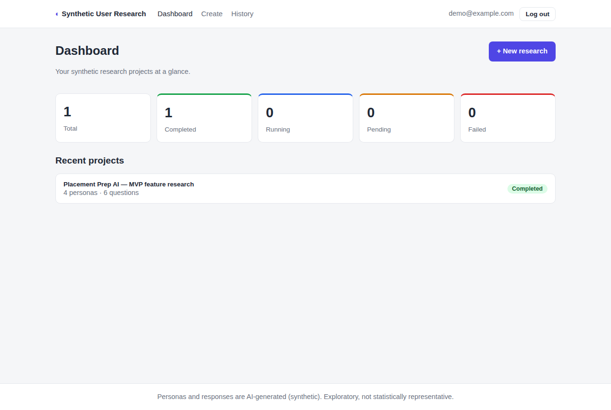
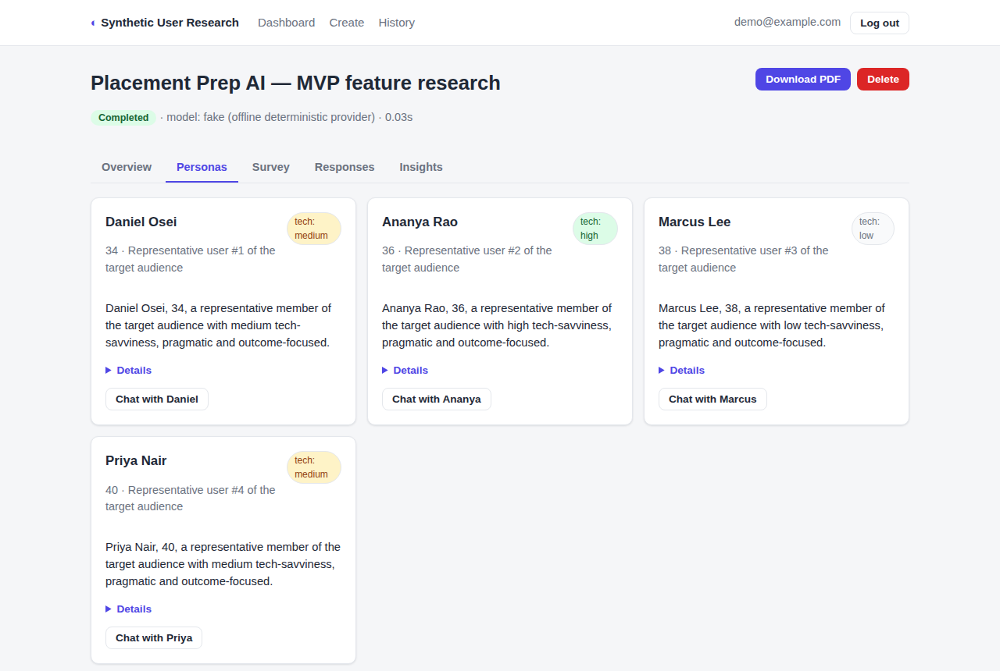
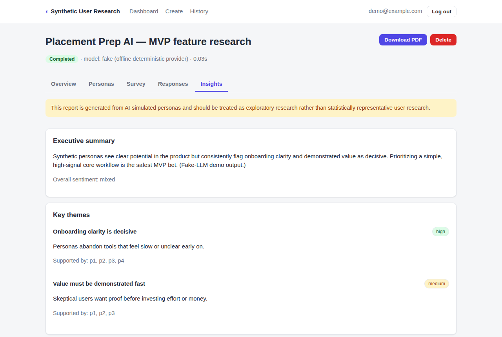
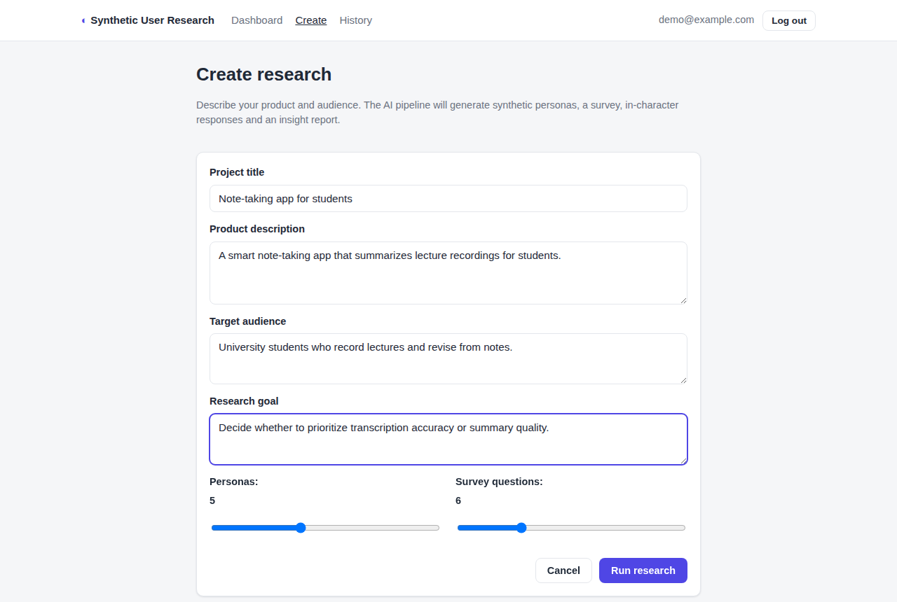
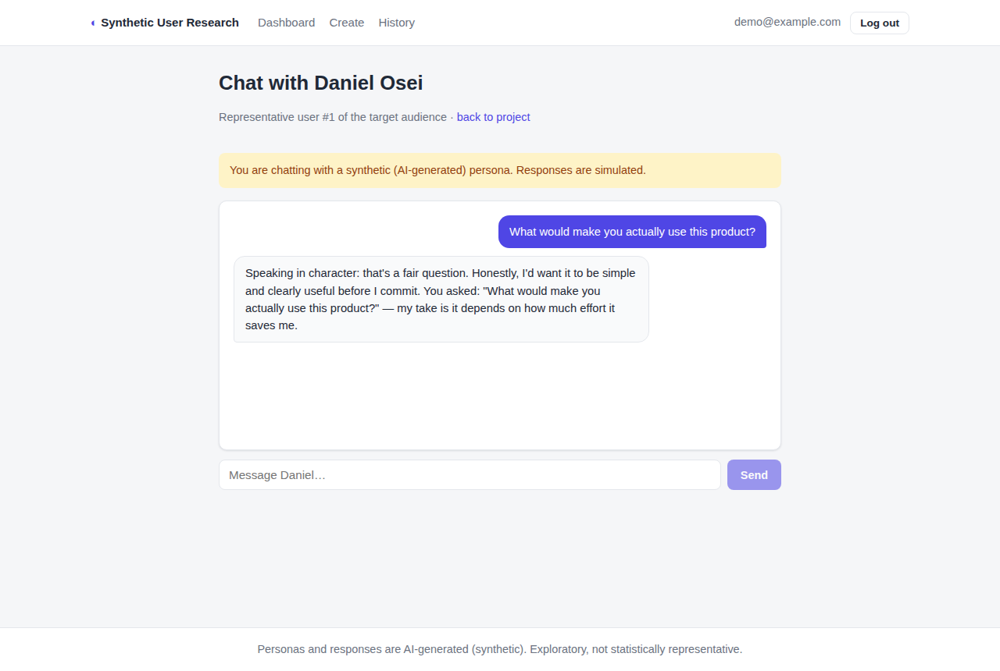

# Synthetic User Research Platform

Generate **AI-simulated user personas**, run them through a survey, extract
insights, chat with any persona, and export a PDF report — behind a real REST API,
a relational database, JWT auth and a React frontend.

> ⚠️ **Synthetic-research disclaimer.** Personas and their responses are generated
> by a language model. Treat every result as *exploratory* signal to help form
> hypotheses — **not** as statistically representative real-user research.

<p align="center">
  
</p>

---

## Problem

Talking to real users early is slow and expensive. Founders and PMs often ship
features on gut feel because running even a small qualitative study takes weeks.

## Solution

This platform simulates a lightweight qualitative study in minutes. You describe a
product, an audience and a research goal; a multi-agent AI pipeline generates
diverse personas, writes a tailored survey, has each persona answer *in character*,
and synthesizes themes, risks and prioritized recommendations — then lets you
interview any persona conversationally and download a PDF report. It is explicitly
framed as exploratory, synthetic research.

## Features

- **Multi-agent AI pipeline** (LangGraph): Persona → Survey → Response → Insight.
- **Structured LLM output** (Pydantic) — no fragile string parsing.
- **Persistent research runs** with real `PENDING → RUNNING → COMPLETED/FAILED` status.
- **Persona chat** with conversation history that survives restarts.
- **PDF report** export with a synthetic-data disclaimer.
- **JWT auth** — users only ever see their own projects.
- **Offline/fake-LLM mode** — run the whole product and the test suite with no API key.
- **94% backend test coverage**, CI (lint + type-check + tests), Docker Compose.

## Screenshots

| Persona explorer | Insights |
|---|---|
|  |  |

| Create research | Persona chat |
|---|---|
|  |  |

*Screenshots are of the running app in offline (fake-LLM) mode; the data shown is
synthetic scaffolding.*

## Architecture

```
React + TypeScript (Vite SPA)
        │  REST / JWT
        ▼
FastAPI backend  (modular monolith)
  ├─ api/v1        thin routers: validation, status codes, error envelope
  ├─ services      business logic (research orchestration, auth, chat)
  ├─ repositories  all DB access (no ORM leakage into routers)
  ├─ models        SQLAlchemy ORM
  ├─ graph/agents  LangGraph pipeline + centralized LLM service (real | fake)
  ├─ report        reportlab PDF
  └─ core          config, logging, security, exceptions
        │
        ▼
SQLAlchemy → SQLite (dev/test) | PostgreSQL (docker-compose)
```

Long AI runs execute as a FastAPI **background task**; the DB row's status reflects
real progress (no fake progress bars). Full detail in
[`docs/architecture.md`](docs/architecture.md).

## Tech stack

| Layer | Choice |
|---|---|
| Frontend | React 18, TypeScript, Vite, React Router |
| Backend | FastAPI, Pydantic v2, SQLAlchemy 2.0, Alembic |
| AI pipeline | LangGraph, LangChain, OpenRouter (OpenAI-compatible) |
| Database | SQLite (dev/test) / PostgreSQL (Docker) |
| Auth | JWT (PyJWT) + bcrypt (passlib) |
| Tests / quality | pytest, ruff, black, mypy |
| CI / deploy | GitHub Actions, Docker, docker-compose |
| Reports | reportlab |

## AI pipeline

```
product + audience + goal
        ▼
 Persona Agent   → diverse synthetic personas (one LLM call each, dedup-checked)
        ▼
 Survey Agent    → typed questions (likert / open / multiple-choice / yes-no)
        ▼
 Response Agent  → each persona answers in isolation (no cross-contamination)
        ▼
 Insight Agent   → themes, sentiment, risks, recommendations
        ▼
 report / chat
```

Every LLM call goes through one centralized service with retry, model fallback,
timeout and structured tracing. See [`docs/design-decisions.md`](docs/design-decisions.md).

---

## Quick start (Docker — recommended)

```bash
git clone <repository-url>
cd synthetic-user-research-platform
cp .env.example .env          # defaults work out of the box (offline fake-LLM mode)
docker compose up --build
```

Open **http://localhost:8080**. Register an account and create a research project.
Everything runs offline with no API key. To use real LLMs, set `LLM_PROVIDER=openrouter`
and `OPENROUTER_API_KEY` in `.env` before `up`.

## Quick start (local, no Docker)

**Backend** (terminal 1):

```bash
cd backend
python -m venv .venv && source .venv/bin/activate     # Windows: .venv\Scripts\activate
pip install -r requirements-dev.txt
cp ../.env.example .env                                # LLM_PROVIDER=fake by default
python -m scripts.seed                                 # optional: demo user + sample project
uvicorn app.main:app --reload
```

API docs at **http://localhost:8000/docs**. Demo login (after seeding):
`demo@example.com` / `demopassword123`.

**Frontend** (terminal 2):

```bash
cd frontend
npm install
npm run dev
```

Open **http://localhost:5173** (the dev server proxies `/api` to the backend).

## Environment variables

Configured in `.env` (see [`.env.example`](.env.example)). Key ones:

| Variable | Default | Purpose |
|---|---|---|
| `LLM_PROVIDER` | `fake` | `fake` (offline) or `openrouter` (real) |
| `OPENROUTER_API_KEY` | — | required when `LLM_PROVIDER=openrouter` |
| `DATABASE_URL` | SQLite file | SQLAlchemy URL |
| `SECRET_KEY` | dev value | JWT signing key — **override in production** |
| `CORS_ORIGINS` | localhost:5173,3000 | allowed SPA origins |

## Testing

```bash
cd backend
pytest --cov=app --cov-report=term-missing      # 49 tests, ~94% coverage
ruff check . && black --check . && mypy app     # lint, format, types
```

Tests never call a real LLM or network — the deterministic fake provider stands in
(spec-compliant LLM mocking, including retry/fallback/failure paths).

## Project structure

```
backend/
  app/
    api/v1/         routers (auth, research, personas, health)
    services/       business logic
    repositories/   data access
    models/         SQLAlchemy ORM
    schemas/        API request/response models
    graph/          LangGraph pipeline, LLM service, fake provider
    agents/         the four agents + persona chat
    report/         reportlab PDF
    core/           config, logging, security, exceptions
  tests/            unit / API / DB / authz / LLM tests
  alembic/          migrations
  streamlit_app.py  optional lightweight dev/demo UI
frontend/
  src/              React + TS SPA (pages, components, api client, context)
docs/               architecture, database, design-decisions, interview-prep
.github/workflows/  CI
```

## Documentation

- [Architecture](docs/architecture.md) — components, data flow, request lifecycle
- [Database](docs/database.md) — schema, relationships, ER diagram, indexes
- [Design decisions](docs/design-decisions.md) — why each technology
- [Interview preparation](docs/interview-preparation.md) — Q&A grounded in this code
- [Project audit](PROJECT_AUDIT.md) — the pre-upgrade audit that drove this work

## Limitations (honest)

- Personas are **synthetic**; results are exploratory, not representative. Surfaced
  in the UI, the report and every insight.
- The pipeline runs in-process as a background task — fine for one instance, not for
  high concurrency. The scale path (queue + workers) is documented, not implemented.
- No performance benchmarks are claimed because none were measured.
- `fake` LLM mode returns deterministic placeholder content; real insight quality
  depends on the configured model.

## Future improvements

- Move long AI runs to a task queue (Celery/RQ + Redis) with worker autoscaling.
- Response caching for identical (product, audience) inputs to cut LLM cost.
- Richer analytics (sentiment charts, cross-persona comparison).
- Export to CSV/JSON in addition to PDF.

## License

MIT — see [LICENSE](LICENSE).
