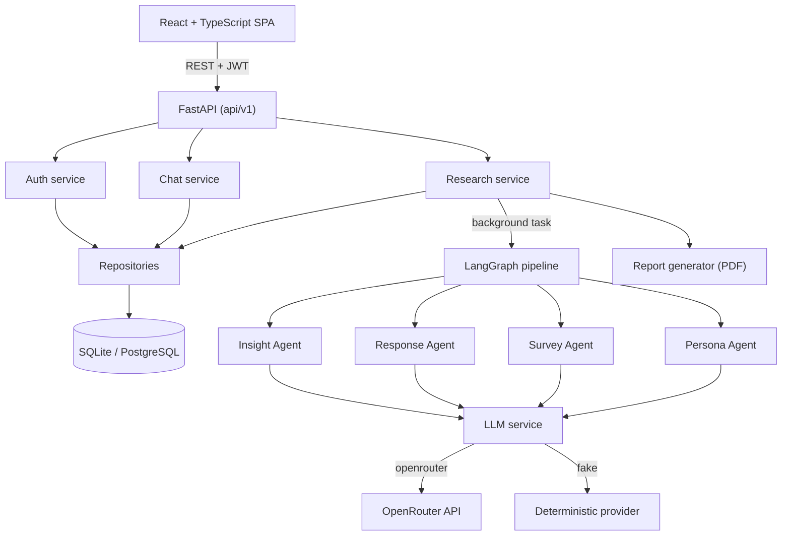

# Architecture

## Overview

A **modular monolith**: one deployable FastAPI backend with clear internal layers,
a separate React SPA, and a relational database. No microservices — the domain is
small and cohesive, and a monolith keeps the AI pipeline, persistence and API in one
transaction boundary (see [design-decisions.md](design-decisions.md)).



## Layers (backend)

| Layer | Responsibility | Rule |
|---|---|---|
| `api/v1` | HTTP: validation, status codes, auth dependency, error envelope | No business logic |
| `services` | Business logic and orchestration | No raw HTTP, no SQL |
| `repositories` | All database access | Only place that touches the ORM query API |
| `models` | SQLAlchemy ORM entities | — |
| `schemas` | Pydantic request/response contracts | Separate from ORM and from LLM schemas |
| `graph` + `agents` | The AI pipeline + centralized LLM service | Provider-agnostic |
| `report` | reportlab PDF rendering | Pure function of ORM data |
| `core` | config, logging, security, exceptions | Cross-cutting |

This separation is what the spec asks for: "Do not put all business logic directly
inside route functions." A router validates input, calls a service, and shapes the
response; the service coordinates repositories and the pipeline; repositories own SQL.

## Request lifecycle — creating research

```
POST /api/v1/research
  → router validates ResearchCreateRequest (length caps, persona/question bounds)
  → get_current_user (JWT) resolves the owner
  → ResearchService.create() persists a ResearchProject (status=PENDING)
  → BackgroundTasks schedules execute_research_run(project_id)
  → 201 returns immediately with the project (status=PENDING)

background: execute_research_run(project_id)   [own DB session]
  → status = RUNNING, started_at, model_used
  → run_pipeline(...)  persona → survey → response → insight
  → persist personas, questions, responses, insight report + themes
  → status = COMPLETED, completed_at, duration_seconds
  → on any error: status = FAILED, safe error_message (full error logged)
```

The frontend polls `GET /research/{id}` every ~2.5s while status is `PENDING`/`RUNNING`
and renders the artifacts once `COMPLETED`. Progress is **real** (derived from the
status column), never simulated.

## Data flow — end to end

```
User → SPA form → POST /research → ResearchService → DB (PENDING)
                                          │
                              background task (RUNNING)
                                          ▼
                    LangGraph: Persona→Survey→Response→Insight
                                          │
                                    LLM service (real|fake)
                                          ▼
                        structured Pydantic results → mapped to ORM → DB (COMPLETED)
                                          ▼
   SPA polls GET /research/{id} → renders personas / survey / responses / insights
   SPA → POST /personas/{id}/chat → ChatService → LLM → persisted messages
   SPA → GET  /research/{id}/report → reportlab → PDF download
```

## Cross-cutting concerns

- **Config** (`core/config.py`): a single pydantic-settings object; every env var is
  declared once and validated at startup.
- **Logging** (`core/logging.py`): structured single-line JSON with a per-request
  `request_id` (middleware) and per-run `run_id` (contextvars), so all log lines for a
  request or a research run correlate. Secrets and full prompts are never logged.
- **Errors** (`core/exceptions.py`): every error becomes
  `{"success": false, "error": {"code","message"}}`. Internal details are logged, not returned.
- **Security** (`core/security.py`): bcrypt password hashing; JWT access tokens. Every
  research route is scoped to the owning user; other users get 404 (existence not leaked).

## Observability

Each research run logs `research.created/started/completed/failed` with the run id,
duration and model; each LLM call logs `llm.call.ok/retry/model.exhausted` with the
label, provider, model, attempt and duration. The `ResearchProject` row also stores
`model_used`, `started_at`, `completed_at`, `duration_seconds` and `error_message`.

## Scaling path (documented, not implemented)

```
Client → Load balancer → FastAPI instances (stateless)
                              │ enqueue
                              ▼
                        Task queue (Redis) → AI workers → DB
```

Today the pipeline runs in-process as a background task — correct and simple for a
single instance. Under real concurrency the run step would move to a queue + worker
pool so the API stays responsive and LLM cost/concurrency is centrally controlled.
This is deliberately **not** built (no real load justifies it yet); see
[design-decisions.md](design-decisions.md).
