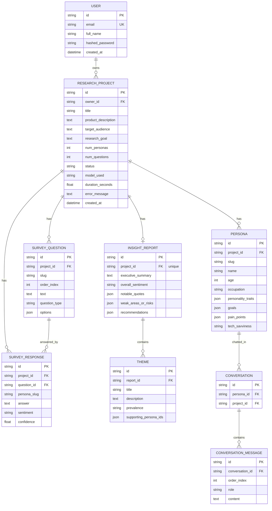

# Database

SQLAlchemy 2.0 ORM with Alembic migrations. SQLite for local dev/tests (zero setup),
PostgreSQL in Docker Compose. The same models and migrations run on both.

## ER diagram



## Tables

| Table | Purpose |
|---|---|
| `users` | Accounts. `email` unique + indexed; only `hashed_password` stored. |
| `research_projects` | One project == one research run. Inputs + run status/observability. |
| `personas` | Generated personas. `slug` is the pipeline-stable id (`p1`…). |
| `survey_questions` | Typed questions with `order_index` and optional `options` (JSON). |
| `survey_responses` | One row per (persona, question) — the LLM's per-persona object flattened. |
| `insight_reports` | One per project (1:1). Scalar fields + JSON string-lists. |
| `themes` | Structured children of a report (title, description, prevalence, supporters). |
| `conversations` | A persona-chat session. |
| `conversation_messages` | Ordered messages (`user` / `persona`) — chat history persisted. |

## Keys and relationships

- **Primary keys**: UUID strings (`String(36)`), generated in the app. Portable across
  SQLite/PostgreSQL and non-guessable (no sequential-id enumeration).
- **Foreign keys**: every child references its parent with `ondelete="CASCADE"`, and
  the ORM relationships use `cascade="all, delete-orphan"` so deleting a project (or user)
  removes all descendants in one operation.
- **1:1**: `insight_reports.project_id` is `unique` — a project has at most one report.
- **Flattening decision**: the pipeline models a response as *persona → list of answers*.
  In the DB that becomes one `survey_responses` row per (persona, question). This makes
  responses queryable/aggregatable (e.g. sentiment by question) instead of an opaque blob.

## Indexes

Indexed columns (beyond primary keys):

- `users.email` (unique) — login lookups.
- `research_projects.owner_id` — "my projects" list and dashboard.
- `research_projects.status` — dashboard status counts.
- All child `*.project_id` FKs — fetching a project's artifacts.
- `survey_responses.question_id`, `survey_responses.persona_slug` — response joins/grouping.
- `conversations.persona_id`, `conversation_messages.conversation_id` — chat loads.

## Why relational (not NoSQL)?

The domain is inherently relational: a project owns personas, questions, responses,
one report; a report owns themes; a persona owns conversations that own messages.
These are clear parent/child relationships with referential integrity and cascade
deletes — exactly what a relational DB does well. Free-form, structure-light fields
(a persona's `goals`, a question's `options`, a report's `recommendations`) are stored
as JSON columns to avoid over-normalizing simple string lists.

## Migrations

```bash
cd backend
alembic upgrade head                              # apply
alembic revision --autogenerate -m "message"      # create a new migration after model changes
```

In dev/test on SQLite the app also creates tables on startup for zero-setup runs;
production (Docker) relies solely on `alembic upgrade head` (run in the backend
container's start command).
